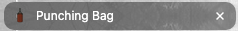

# Build a Cookie Clicker Game

Week 3 assignment - Build a Cookie Clicker Game

Created a cookie-clicker inspired game called Punching Bag as part of the Tech Educators course.

This is built on VSCode using HTML, CSS and JavaScript.

## Requirements
- 🎯 Fetch upgrade data from the provided API & at least one upgrade from the API update the cookie count. ✅
- 🎯 Ensure that functions are used effectively to keep code organised and reusable. ✅
- 🎯 Implement event listeners to handle user interactions. ✅ 
- 🎯 Use local storage to save and restore the cookie count and relevant game information. ✅
- 🎯 Use setInterval to increment the cookie count and manage the game state each second. ✅
    -  Managing the game state includes saving progress and updating the DOM.

## Stretch Requirements
- 🏹 Consolidate upgrade management by managing all upgrades in a single function. ✅
- 🏹 Improve UX with animations, sound effects, or other visual effects. ✅
- 🏹 Fantastic use of README to provide important information such as a description of the project, how to deploy and other app information. ✅
- 🏹 Implement error handling using try/catch. ✅ 
- 🏹 Create a menu for users to adjust game options like sound effects or display preferences. ✅

## Reflection:

This week, we had to build a simple clicking game. I took inspiration from the cookie clicker game and created my own version called Punching Bag. 

I have managed to achieve the requirements for this assignment. As a challenge to myself, I also took on the stretch requirements and successfully completed this too. 

When implementing the try/catch statements for error handling, I read through MDN docs and codecademy resources. I added this statement in my fetchUpgrades function just in case an error occurs there since it is the part that is most likely to fail. Any errors encountered will be logged accordingly.  

There were a couple of things that I found difficult with this assignment. The first one was trying to save the game progress for users in local storage. At first, I wrote the localStorage into my clickCounter function. It did manage to save the data but everytime I refreshed the page, it wouldn't update the display on the webpage. I went over the class resources that was provided in Moodle and decided to write localStorage as its own function for better readability. It now saves all the game progress like the punchCount and cps, and displays it correctly even after refreshing the page. 

Another difficulty I experienced was with CSS Grid. I initially wanted to use the grid display but it was giving me a lot of issues when trying to place specific elements on the page. My footer kept overflowing pass the view height that I gave my containers and it was not what I wanted. After many attempts trying to fix this, it was unsuccessful so I decided to use CSS Flex instead. Using display flex managed to sort out my overflowing issue and I was able to place all the elements on the page to where I want it after numerous trial and error. 

One thing I did learn in this assignment was that I was able to remove the background and border of the buttons. When I first set an image in place of the button, it was showing a white background, which is not what I wanted. After researching online and reading from websites like Stack Overflow, I found that I could just set the background and border as none. 

One goal that I was unable to achieve was to change the name of the upgrades to match the theme of my game. I have researched how it can be done but as I wanted to focus more on getting the requirements completed and making sure the game works, I decided to leave it out. The upgrades may not match the theme of my game but I am pleased with how it turned out. 

Overall, this assignment did have its fair shares of difficulty but I did utilised what I learned from last week's assignment and implemented it into my Punching Bag game, along with new JavaScript knowledge I picked up from the lessons this week. I continuously researched and watched tutorials which helped me build my knowledge on adding additional things in this assignment. I have also implemented better commit messages for better readability. I am proud with how much I managed to accomplish so far in this course, especially since this is only week 3. 

Any feedback will be appreciated as I am always looking for ways to continuously improve.

## Errors or Bugs 
- While inspecting my webpage, the 404 favicon error keeps popping up. With the help of my fellow bootcamper and reading through documentation, I was able to sort out the issue. I used one of the images in my game and converted it into an .ico image and added it to ```<head>``` section of my index.html file:
    

    ;

## Resources:
These are the tutorials and resources that I found useful that helped me with this assignment: 
- https://developer.mozilla.org/en-US/docs/Web/JavaScript/Reference/Global_Objects/Array/filter
- https://www.youtube.com/watch?v=1C-seWzn9vo&ab_channel=Soupy 
- https://www.youtube.com/watch?v=d6lHO2EI1WI&ab_channel=OnlineTutorials
- https://www.youtube.com/watch?v=0R6rZngcHGg&ab_channel=ProgrammingTT
- https://developer.mozilla.org/en-US/docs/Web/JavaScript/Reference/Statements/try...catch
- https://www.w3schools.com/html/html_favicon.asp#:~:text=To%20add%20a%20favicon%20to,is%20%22favicon.ico%22.
- https://www.codecademy.com 

## Sound Effect Audio:
- Sound Effect by freesound_community from Pixabay 